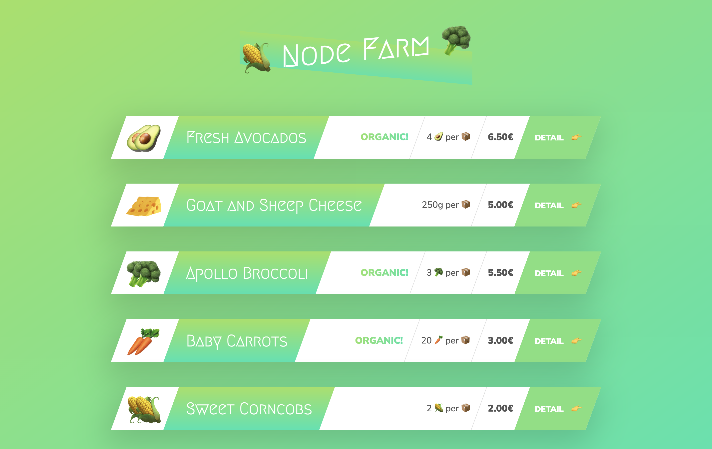

<h1 align="center">🌽 Node Farm 🥦</h1>

This project serves as an illustrative example of a straightforward server-side application developed with Node.js and HTTP. Within this application, the process involves extracting data from a JSON file, dynamically creating HTML templates, and subsequently distributing them to the client based on the specific URL requested.

  
  

Click [here]() and visit the Node Farm.

## Project Structure

  
The project consists of the following modules and files:

  <ul>
    <li><strong>Modules:</strong>
      <ul>
        <li><code>fs</code> - provides file system-related functionality.</li>
        <li><code>http</code> - provides HTTP server and client functionality.</li>
        <li><code>url</code> - provides URL parsing and formatting.</li>
        <li><code>slugify</code> - a module for converting strings into URL-friendly slugs.</li>
        <li><code>replaceTemplate</code> - a custom module for replacing placeholders in HTML templates.</li>
      </ul>
    </li>
    <li><strong>Server:</strong>
      <ul>
        <li><code>data.json</code> - a JSON file containing product data.</li>
        <li><code>template-overview.html</code> - an HTML template for the overview page.</li>
        <li><code>template-card.html</code> - an HTML template for the product cards.</li>
        <li><code>template-product.html</code> - an HTML template for the individual product page.</li>
        <li><code>index.js</code> - the main server file.</li>
      </ul>
    </li>
  </ul>

<h2 >Usage</h2>

  
To run the project, follow these steps:

  <ol>
    <li>Install Node.js if you haven't already.</li>
    <li>Clone the <a href="https://github.com/beRajeevKumar/Node-Farm.git">repository</a>  or download the project files.</li>
    <li>Open a terminal in the project directory.</li>
    <li>Run the following command to install the required dependencies:</li>
  </ol>

  <pre><code>npm install</code></pre>

  <ol start="5">
    <li>Run the following command to start the server:</li>
  </ol>

  <pre><code>npm start</code></pre>

  
Open a web browser and navigate to <code>http://localhost:8000</code> to access the application.

<h2>Routes</h2>

  
The server handles the following routes:

  <ul>
    <li><code>/</code> or <code>/overview</code>: Displays the overview page with all the product cards.</li>
    <li><code>/product?id={productId}</code>: Displays the individual product page for the specified product ID.</li>
    <li><code>/api</code>: Returns the raw JSON data.</li>
  </ul>

## Tech stack

#### Backend

- JavaScript
- Node.js
- API
- JSON

#### Other Tools

- VS Code
- Pretier

## Useful Links

- [Project Demo](https://kanban-task-management-rajeev.vercel.app/) for Web version

- [Project Repository](https://github.com/beRajeevKumar/Node-Farm.git)

## Need help?

Feel free to contact me on [Twitter](https://twitter.com/be_rajeevkumar) or [LinkedIn](https://www.linkedin.com/in/berajeevkumar/), know more about me at [My Portfolio](https://iamrajeev.me/).

<h1 align=center>Happy Coding 👨‍💻</h1>

Show some ❤️&nbsp; by giving the star to this repo

